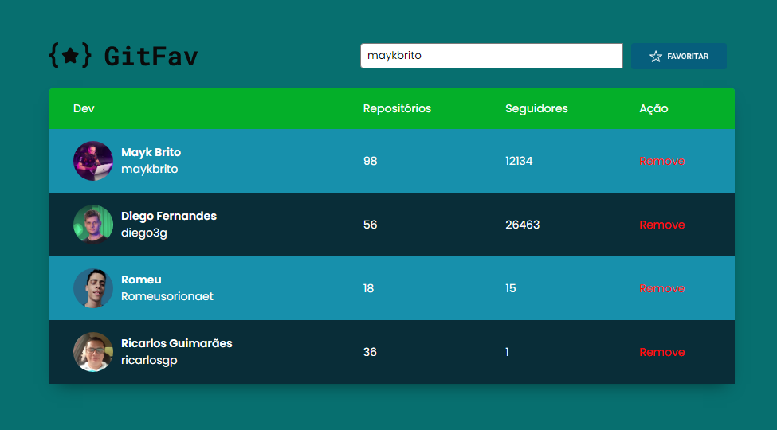

# GITHUB FAVORITES
A idéia desse projeto é favoritar as pessoas do GitHub. 

## 🛠 Habilidades
Javascript, HTML, CSS...

## Funcionalidades

- SPA
- Alterando comportamento padrão do evento de redirecionamento
- Mapeando as rotas
- Javascript Assíncrono e Promises
- Orientação a Objetos no JavaScript
- Adicionando um servidor local e simples com NodeJS
- Construindo tabelas no HTML
- Iniciando o CSS e definindo acessibilidade sr-only
- Fazendo classes e herança no JS
- Criando HTML com JavaScript
- Imutabilidade para trabalhar com os dados da aplicação
- Conhecendo o localStorage
- Métodos estáticos e promessas
- Promessas com Async Await
- Cuidando do fluxo da apliação com try, catch, throw

## 🚀 Sobre mim
Eu sou uma pessoa desenvolvedora web Front-end web development.

## 🔗 Links

- e-mail: ricarlosgp@gmail.com

